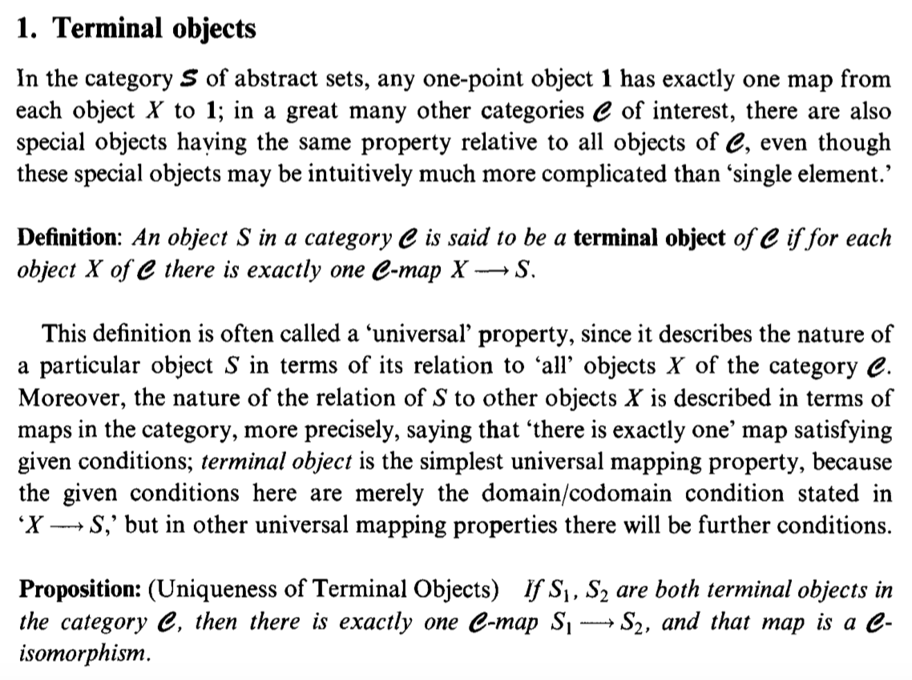
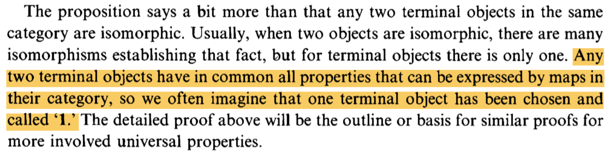
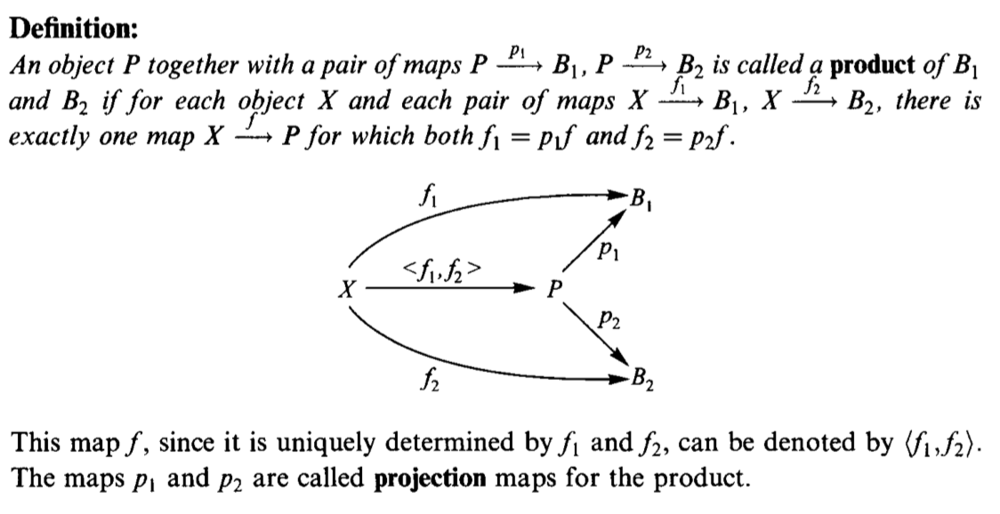
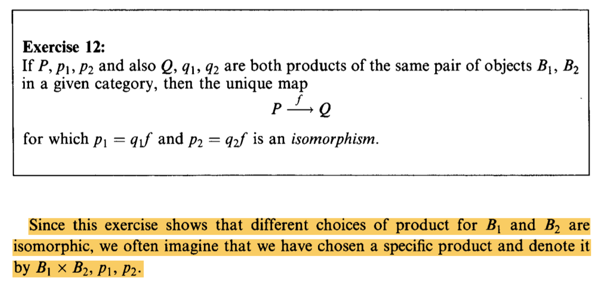
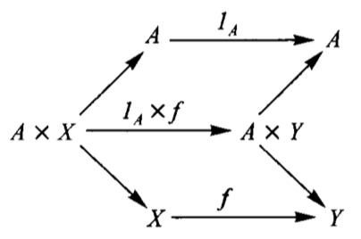
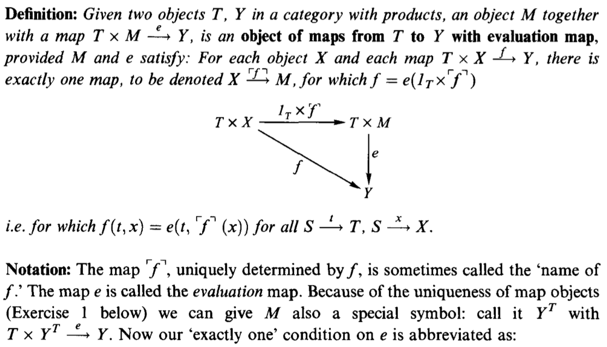
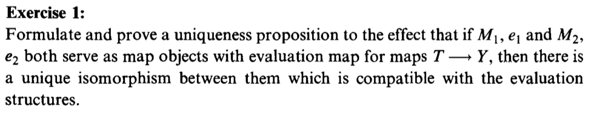
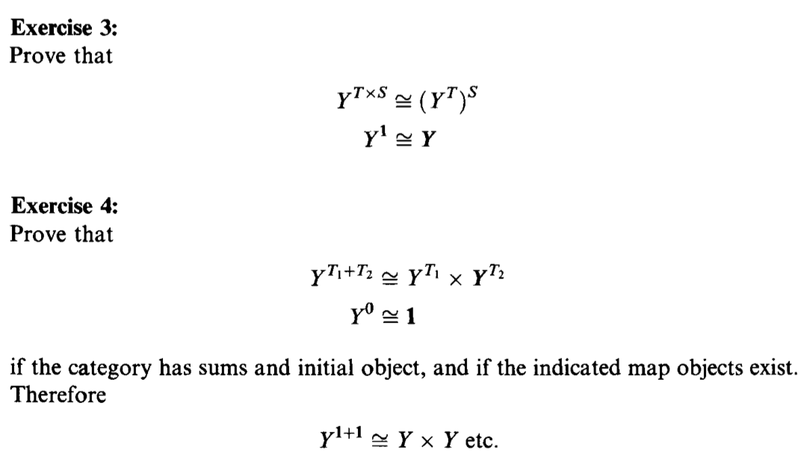
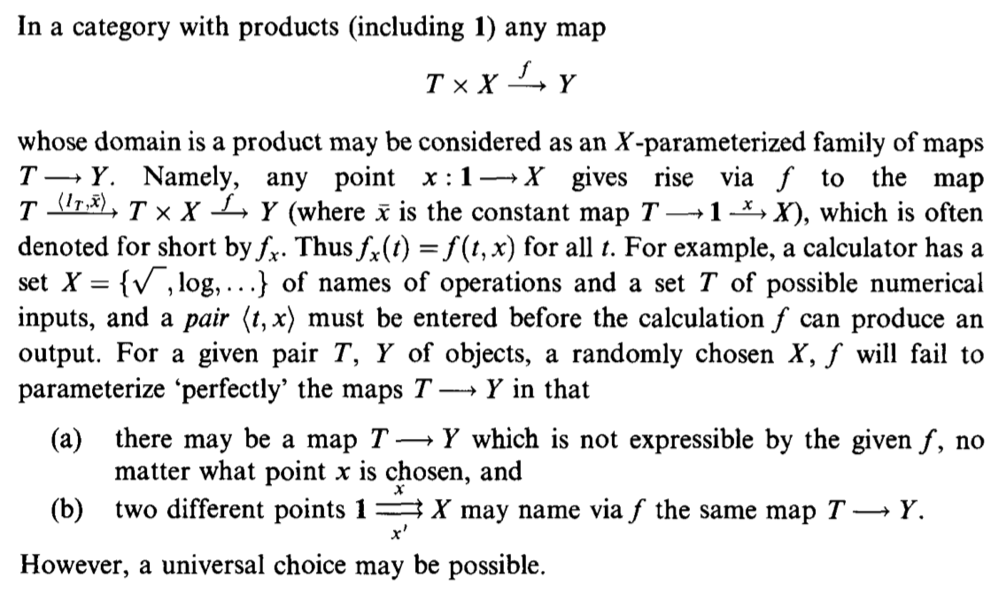
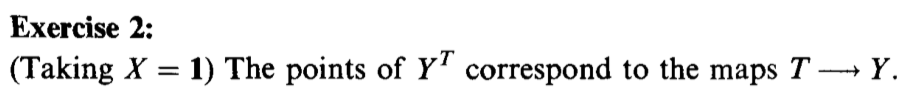

## Function Types


### Category theory study group

<script src="http://ajax.googleapis.com/ajax/libs/jquery/1.9.1/jquery.min.js"></script>

*** For text alignment check the following
*** https://github.com/hakimel/reveal.js/issues/1897
*** https://stackoverflow.com/questions/21019476/how-can-i-get-left-justified-paragraphs-in-reveal-js?utm_medium=organic&utm_source=google_rich_qa&utm_campaign=google_rich_qa

This is the title page.

---

## Functoriality Homework


--- &vertical

<style type="text/css">
p { text-align: left; }
</style>

### Challenge 1


Show that the data type:

```haskell
data Pair a b = Pair a b
```
is a bifunctor. For additional credit implement all three methods of Bifunctor and use equational reasoning to show that these definitions are compatible with the default implementations whenever they can be applied.


***

### My Answer

``` haskell

instance Bifunctor Pair where
  bimap f g (Pair x y) = Pair (f x) (g y)
  
```


--- &vertical

### Challenge 2

Show the isomorphism between the standard definition of Maybe and this desugaring:
```haskell
type Maybe' a = Either (Const () a) (Identity a)
```
Hint: Define two mappings between the two implementations. For additional credit, show that they are the inverse of each other using equational reasoning.

***

### My Answer

``` haskell

mapF ::  Maybe' a -> Maybe a
mapF (Left (Const ())) = Nothing
mapF (Right y) = Just (runIdentity y)

mapB :: Maybe a -> Maybe' a
mapB Nothing = Left (Const ())
mapB (Just x) = Right (Identity x)

```

--- &vertical

### Challenge 3

Let's try another data structure. I call it a PreList because it's a precursor to a List. It replaces recursion with a type parameter b.
```haskell
data PreList a b = Nil | Cons a b
```
You could recover our earlier definition of a List by recursively applying PreList to itself (we'll see how it's done when we talk about fixed points).

Show that PreList is an instance of Bifunctor.


***

### My Answer

```haskell
data PreList a b = Nil | Cons a b

instance Bifunctor PreList where
  bimap f g Nil = Nil
  bimap f g (Cons a b) = Cons (f a) (g b)
```


--- &vertical

### Challenge 4

Show that the following data types define bifunctors in a and b:
```haskell
data K2 c a b = K2 c
data Fst a b = Fst a
data Snd a b = Snd b
```
For additional credit, check your solutions agains Conor McBride???s paper Clowns to the Left of me, Jokers to the Right.

***

### My Answer

```haskell
instance Bifunctor (K2 c) where
  bimap f g (K2 c) = K2 c

instance Bifunctor Fst where
  bimap f g (Fst a) = Fst (f a)

instance Bifunctor Snd where
  bimap f g (Snd b) = Snd (g b)
```

--- &vertical

### Challenge 5
Define a bifunctor in a language other than Haskell. Implement bimap for a generic pair in that language.

***

### My Answer

```scala
trait Bifunctor[F[_,_]]{
        def bimap[A,B,C,D](ac: A => C)(bd: B => D): F[A,B] => F[C,D]
            =  first[A,D,C](ac) compose second[A,B,D](bd)

        def first[A,B,C]: (A => C) => F[A,B] => F[C,B]
            = (g) => bimap(g)(identity)

        def second[A,B,D]: (B => D) => F[A,B] => F[A,D]
        = bimap(identity)
    }

    case class Pair[A,B](a: A, b: B)

    object Bifunctor{
        implicit def pairBifunctor: Bifunctor[Pair] = new Bifunctor[Pair] {
            override def bimap[A, B, C, D](ac: A => C)(bd: B => D): Pair[A, B] => Pair[C, D] = {
                case Pair(a, b) => Pair(ac(a), bd(b))
            }
        }
    }

```

--- &vertical

### Challenge 6
Should std::map be considered a bifunctor or a profunctor in the two template arguments Key and T? How would you redesign this data type to make it so?


---

## Function Types

--- &vertical 

### First things first

It is important to understand 
* isomorphism
* initial objects / terminal objects
* universal mapping proerties
* how to read category graphs

*** 

### Terminal objects
<div style='text-align: center;'>
    
</div>

*** 

### Pick one

<div style='text-align: center;'>
    
</div>

*** 

### Products

<div style='text-align: center;'>
    
</div>

*** 

### Pick a product

<div style='text-align: center;'>
    
</div>

*** 

### Define the map  $ id \times f $

<div style='text-align: center;'>
    
</div>

--- &vertical 

### Map object

<div style='text-align: center;'>
    
</div>

***

### Filling the gap

<div style='text-align: center;'>
    
</div>

***

### Challenges

<div style='text-align: center;'>
    
</div>

***

### More intuition

<div style='text-align: center;'>
    
</div>

***

### A map object can be seen as a collection of maps

<div style='text-align: center;'>
    
</div>


---

# Thank you! 


